# Citrix Netscaler Universal Orchestrator

Orchestrator to manage certificates and keys on one to many VServers in Netscaler.  The integration supports Enrollment, Renewal, Inventory and Remove from Store.

#### Integration status: Production - Ready for use in production environments.

## About the Keyfactor Universal Orchestrator Extension

This repository contains a Universal Orchestrator Extension which is a plugin to the Keyfactor Universal Orchestrator. Within the Keyfactor Platform, Orchestrators are used to manage “certificate stores” &mdash; collections of certificates and roots of trust that are found within and used by various applications.

The Universal Orchestrator is part of the Keyfactor software distribution and is available via the Keyfactor customer portal. For general instructions on installing Extensions, see the “Keyfactor Command Orchestrator Installation and Configuration Guide” section of the Keyfactor documentation. For configuration details of this specific Extension see below in this readme.

The Universal Orchestrator is the successor to the Windows Orchestrator. This Orchestrator Extension plugin only works with the Universal Orchestrator and does not work with the Windows Orchestrator.

## Support for Citrix Netscaler Universal Orchestrator

Citrix Netscaler Universal Orchestrator is supported by Keyfactor for Keyfactor customers. If you have a support issue, please open a support ticket with your Keyfactor representative.

###### To report a problem or suggest a new feature, use the **[Issues](../../issues)** tab. If you want to contribute actual bug fixes or proposed enhancements, use the **[Pull requests](../../pulls)** tab.

---

## Keyfactor Version Supported

The minimum version of the Keyfactor Universal Orchestrator Framework needed to run this version of the extension is 10.1

## Platform Specific Notes

The Keyfactor Universal Orchestrator may be installed on either Windows or Linux based platforms. The certificate operations supported by a capability may vary based what platform the capability is installed on. The table below indicates what capabilities are supported based on which platform the encompassing Universal Orchestrator is running.
| Operation | Win | Linux |
|-----|-----|------|
|Supports Management Add|&check; |&check; |
|Supports Management Remove|&check; |&check; |
|Supports Create Store|  |  |
|Supports Discovery|  |  |
|Supports Renrollment|  |  |
|Supports Inventory|&check; |&check; |

## PAM Integration

This orchestrator extension has the ability to connect to a variety of supported PAM providers to allow for the retrieval of various client hosted secrets right from the orchestrator server itself.  This eliminates the need to set up the PAM integration on Keyfactor Command which may be in an environment that the client does not want to have access to their PAM provider.

The secrets that this orchestrator extension supports for use with a PAM Provider are:

| Name           | Description                                                                                                                                                                                                                                                                                                                 |
|----------------|-----------------------------------------------------------------------------------------------------------------------------------------------------------------------------------------------------------------------------------------------------------------------------------------------------------------------------|
| Property | Value                                                                                                                                                                                                           |
| Property | Value
  

It is not necessary to use a PAM Provider for all of the secrets available above. If a PAM Provider should not be used, simply enter in the actual value to be used, as normal.

If a PAM Provider will be used for one of the fields above, start by referencing the [Keyfactor Integration Catalog](https://keyfactor.github.io/integrations-catalog/content/pam). The GitHub repo for the PAM Provider to be used contains important information such as the format of the `json` needed. What follows is an example but does not reflect the `json` values for all PAM Providers as they have different "instance" and "initialization" parameter names and values.

General PAM Provider Configuration

### Example PAM Provider Setup

To use a PAM Provider to resolve a field, in this example the __Server Password__ will be resolved by the `Hashicorp-Vault` provider, first install the PAM Provider extension from the [Keyfactor Integration Catalog](https://keyfactor.github.io/integrations-catalog/content/pam) on the Universal Orchestrator.

Next, complete configuration of the PAM Provider on the UO by editing the `manifest.json` of the __PAM Provider__ (e.g. located at extensions/Hashicorp-Vault/manifest.json). The "initialization" parameters need to be entered here:

~~~ json
  "Keyfactor:PAMProviders:Hashicorp-Vault:InitializationInfo": {
    "Host": "http://127.0.0.1:8200",
    "Path": "v1/secret/data",
    "Token": "xxxxxx"
  }
~~~

After these values are entered, the Orchestrator needs to be restarted to pick up the configuration. Now the PAM Provider can be used on other Orchestrator Extensions.

### Use the PAM Provider
With the PAM Provider configured as an extenion on the UO, a `json` object can be passed instead of an actual value to resolve the field with a PAM Provider. Consult the [Keyfactor Integration Catalog](https://keyfactor.github.io/integrations-catalog/content/pam) for the specific format of the `json` object.

To have the __Server Password__ field resolved by the `Hashicorp-Vault` provider, the corresponding `json` object from the `Hashicorp-Vault` extension needs to be copied and filed in with the correct information:

~~~ json
{"Secret":"my-kv-secret","Key":"myServerPassword"}
~~~

This text would be entered in as the value for the __Server Password__, instead of entering in the actual password. The Orchestrator will attempt to use the PAM Provider to retrieve the __Server Password__. If PAM should not be used, just directly enter in the value for the field.

 

---

  
Cert Store Type Settings

 

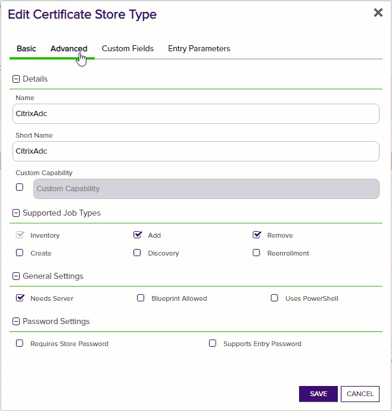

**Basic Settings**

CONFIG ELEMENT	| DESCRIPTION
------------------|------------------
Name	|A descriptive name for the extension.  Example:  CitrixAdc
Short Name	|The short name that identifies the registered functionality of the orchestrator. Must be CitrixAdc.
Custom Capability|Store type name orchestrator will register with. Uncheck This
Job Types	|Inventory (Checked), check the additional checkboxes: Add, Remove
General Settings|Needs Server - Checked Blueprint Allowed - Unchecked Uses PowerShell - Unchecked
Requires Store Password	|Determines if a store password is required when configuring an individual store.  This must be unchecked.
Supports Entry Password	|Determined if an individual entry within a store can have a password.  This must be unchecked.

**Advanced Settings**

CONFIG ELEMENT	| DESCRIPTION
------------------|------------------
Store Path Type	|Determines what restrictions are applied to the store path field when configuring a new store.  Select Freeform
Supports Custom Alias	|Determines if an individual entry within a store can have a custom Alias.  This must be Required.
Private Keys	|This determines if Keyfactor can send the private key associated with a certificate to the store.  This is required since Citrix ADC will need the private key material to establish TLS connections.
PFX Password Style	|This determines how the platform generate passwords to protect a PFX enrollment job that is delivered to the store.  This can be either Default (system generated) or Custom (user determined).

**Custom Fields**

Parameter Name|Display Name|Parameter Type|Default Value|Required|Description
---|---|---|---|---|---
ServerUsername|Server Username|Secret||No|The username to log into the Server
ServerPassword|Server Password|Secret||No|The password that matches the username to log into the Server
ServerUseSsl|Use SSL|Bool|True|Yes|Determine whether the server uses SSL or not

**Custom Fields**

Parameter Name|Display Name|Parameter Type|Default Value|Required When
---|---|---|---|---
virtualServerName|Virtual Server Name|String| |Leave All Unchecked
sniCert|SNI Cert|String|false|Adding Entry

#### STORE TYPE ENTRY PARAMS
CONFIG ELEMENT	| DESCRIPTION
------------------|------------------
Virtual Server	| When Enrolling, this can be a single or comma separated list of VServers in Netscaler to replace.
Key Pair| When Enrolling, this is the name of the Certificate that will be installed on Netscaler

  
Cert Store Setup

 

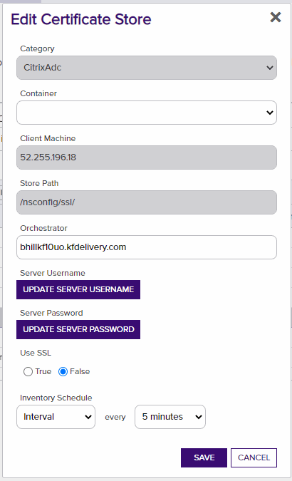

#### STORE CONFIG
CONFIG ELEMENT	| DESCRIPTION
------------------|------------------
Client Machine	| This is the IP Address of the Netscaler Appliance.
Store Path| This is the path of the Netscaler Appliance.  /nsconfig/ssl/.
User| This is the user that will be authenticated against the Netscaler Appliance
Password| This is the password that will be authenticated against the Netscaler Appliance
Use SSL| This should be set to True in Production when there is a valid certificate.
Inventory Schedule| Set this for the appropriate inventory interval needed.

  
Permissions

 

The Netscaler user needs permission to perform the following API calls:

API Endpoint|Methods
---|---
/nitro/v1/config/login|post
/nitro/v1/config/lbvserver| get
/nitro/v1/config/sslcertkey| get, update, add, delete
/nitro/v1/config/sslcertkey_service_binding| get, update, add, delete
/nitro/v1/config/systemfile| get, add, delete

  
Integration Notes and Limitations

 

* Direct PFX Binding Inventory
	* In Netscaler you can directly Bind a Pfx file to a Virtual Server.  Keyfactor cannot inventory these because it does not have access to the password.  The recommended way to Import PFX Files in Netscaler is descibed in this [Netscaler Documentation](https://docs.netscaler.com/en-us/citrix-adc/12-1/ssl/ssl-certificates/export-existing-certs-keys.html#convert-ssl-certificates-for-import-or-export)

* Sepcifiy Multiple VServers and Sni Flags
	* When Binding to Multiple VServers and using Multiple SniFlags, you have to use a comma separated list of values as descibed in Test Case 13 in the Test Cases Section.  This will change in future version so each binding is a store in Keyfactor.

* Down Time When Replacing Certs
	* The orchestrator uses [Netscaler recommended methods](https://docs.netscaler.com/en-us/citrix-adc/12-1/ssl/ssl-certificates/add-group-certs.html) to replace bound certs which creates a sub second blip of downtime.  There is currently no way around this if you want readable keypair names.

* Renewals
	* The renewal process will find the thumprint of the cert on all VServers and renew them in all places.  See test cases #6 and #10 in the Test Cases section.
	

  
Upgrade Procedures

 

* Upgrade From v1.0.2 to v2.0.0
	* In the Keyfactor Command Database, run the following SQL Script to update the store types and store information [Upgrade Script](https://github.com/Keyfactor/citrix-adc-orchestrator/blob/snipamupdates/UpgradeScript.sql)

	

  
Test Cases

 

Case Number|Case Name|Enrollment Params|Expected Results|Passed|Screenshot
----|------------------------|------------------------------------|--------------|----------------|-------------------------
1	|Add Unbound Cert|**Alias:** TC1.boingy.com **Virtual Server Name:** **Sni Cert:** false|Adds New Unbound Cert To Citrix ADC|True|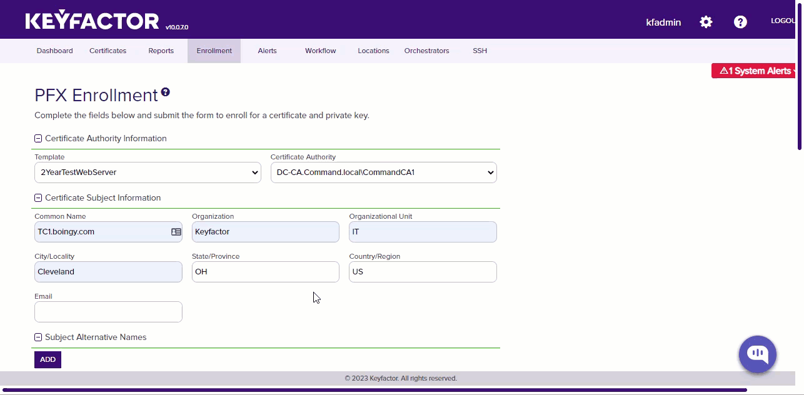
2	|Remove Unbound Cert|**Alias:** TC1.boingy.com **Virtual Server Name:** **Sni Cert:** false|Removes Unbound Cert From Citrix ADC|True|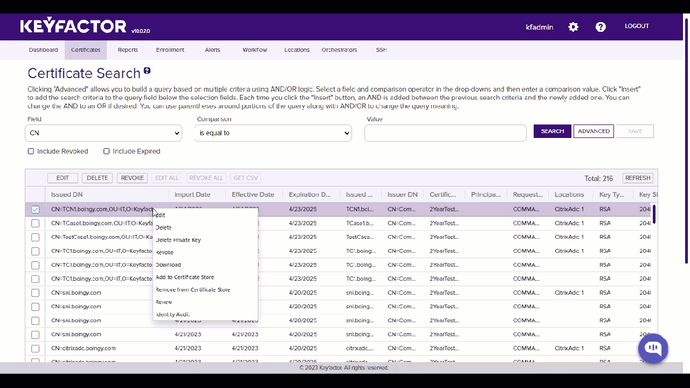
3	|Add Bound Cert|**Alias:** TC3.boingy.com **Virtual Server Name:** TestVServer **Sni Cert:** false|Adds a new bound cert to TestVServer Virtual Server|True|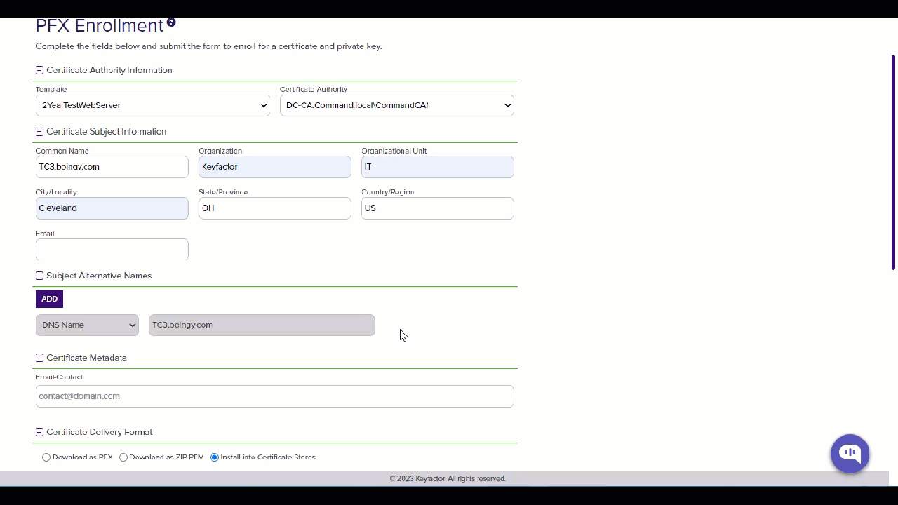
4	|Add Bound Cert Multiple VServers|**Alias:** TC4.boingy.com **Virtual Server Name:** TestVServer,TestVServer2 **Sni Cert:** false,false|Adds New Bound Cert To Both Servers in Citrix|True|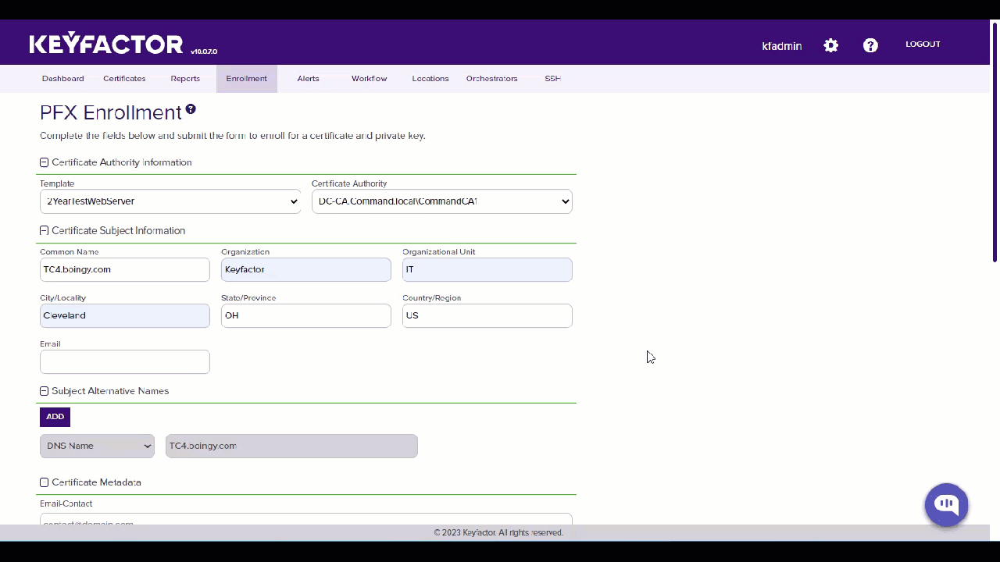
5	|Remove Bound Cert|**Alias:** TC4.boingy.com **Virtual Server Name:** **Sni Cert:** false|Will Not Remove because it is bound.  Must Unbind it First|True|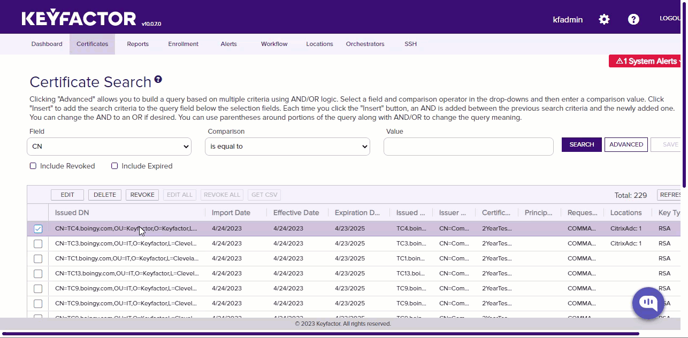
6	|Renew Bound Cert|**Alias:** TC4.boingy.com **Virtual Server Name:** **Sni Cert:** false|Renews Bound Cert on Both VServers|True|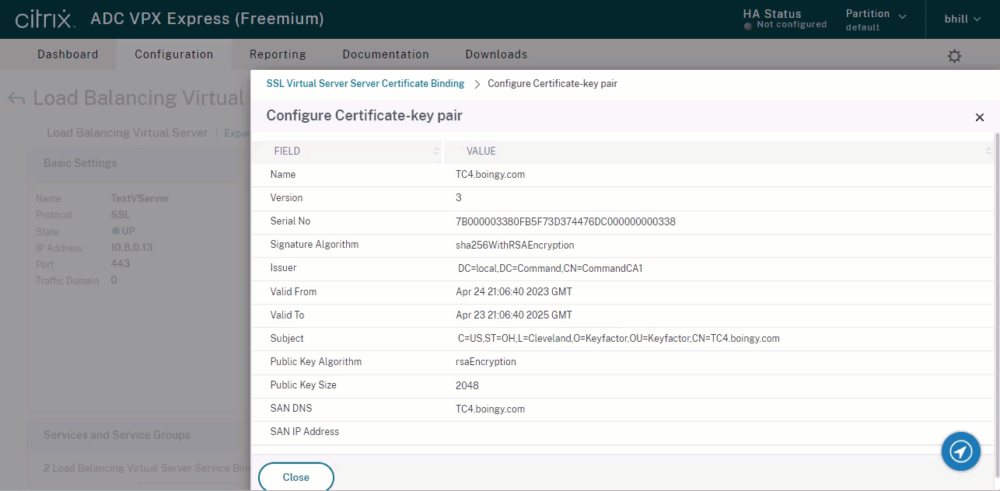
7	|Replace Bound Cert No Overwrite |**Alias:** TC4.boingy.com **Virtual Server Name:** TestVServer,TestVServer2 **Sni Cert:** false,false|Will Not replace, overwrite flag needed|True|
8	|Replace Bound Cert with Overwrite|**Alias:** 16934 **Virtual Server Name:** **Sni Cert:** false|Will do the replace because overwrite was used|True|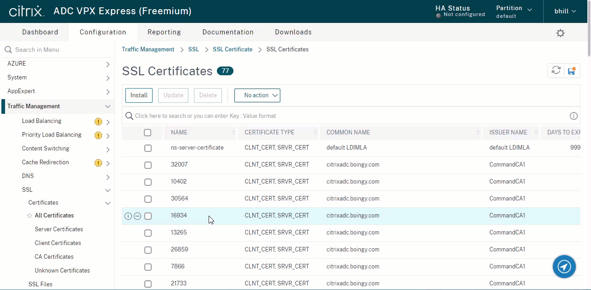
9	|Add Sni Cert and Bind|**Alias:** TC9.boingy.com **Virtual Server Name:** TestVServer **Sni Cert:** false|Will bind an additional SNI Cert to a VServer|True|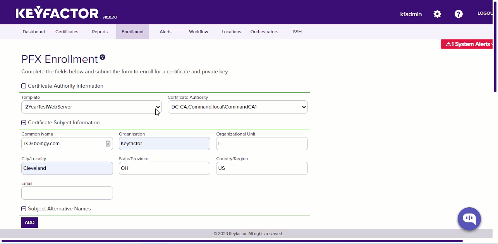
10	|Renew bound Sni Cert|**Alias:** TC10.boingy.com **Virtual Server Name:** **Sni Cert:** false|Will Renew the Sni Cert Bound to the Site|True|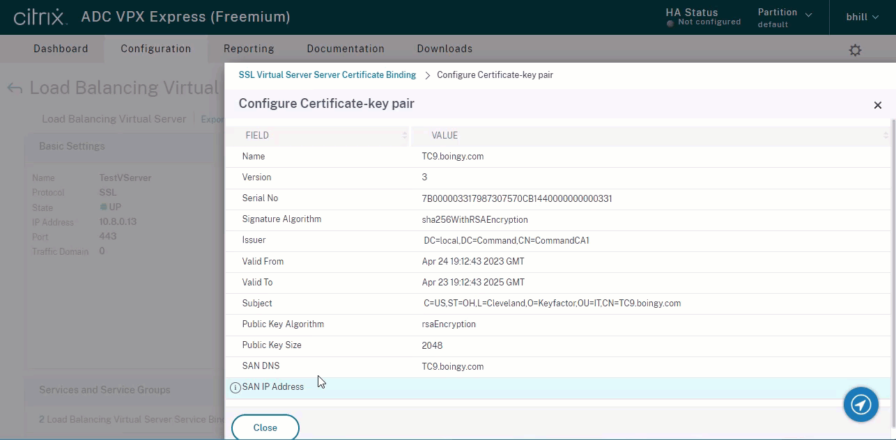
11	|Replace bound Sni Cert with Overwrite|**Alias:** TC9.boingy.com **Virtual Server Name:** TestVServer **Sni Cert:** true|Sni Cert Will Be Replaced and bound|True|
12	|Remove Bound Sni Cert|**Alias:** TC9.boingy.com **Virtual Server Name:** **Sni Cert:** false|Will Not Remove because it is bound.  Must Unbind it First|True|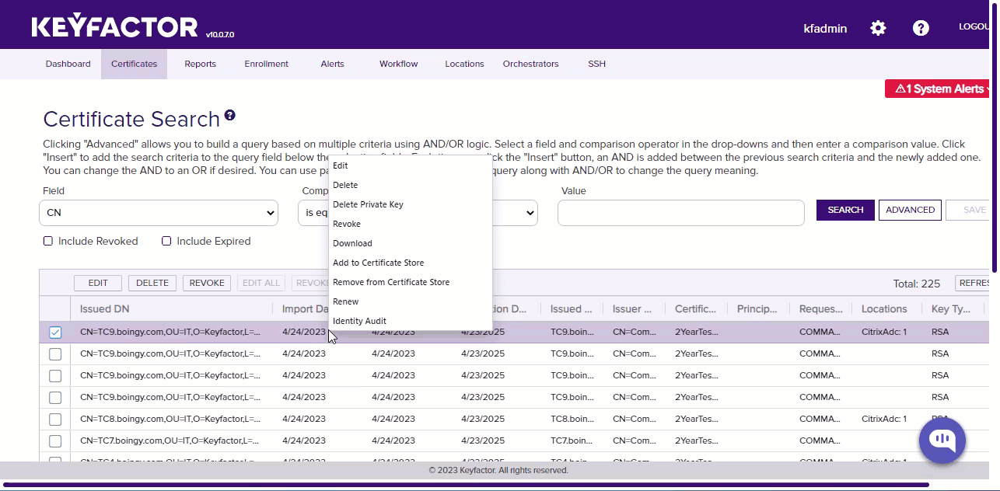
13	|Add Sni Cert To Multiple VServers and bind|**Alias:** TC13.boingy.com **Virtual Server Name:** TestVServer,TestVServer2 **Sni Cert:** false,true|Adds and binds Cert to TestVServer and adds and binds Sni Cert to TestVServer2|True|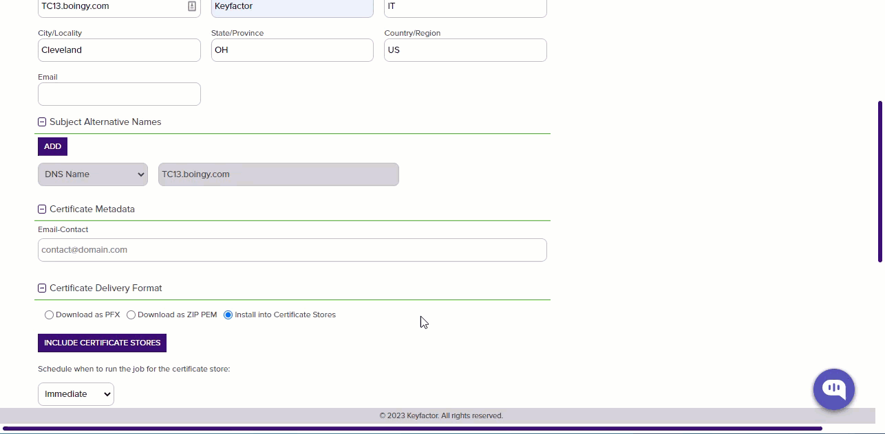
14	|Inventory |No Params|Will Perform Inventory and pull down all Certs Tied to VServers|True|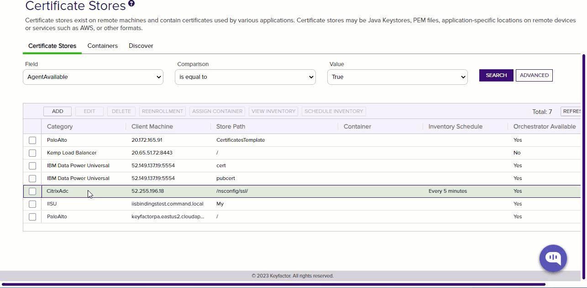

