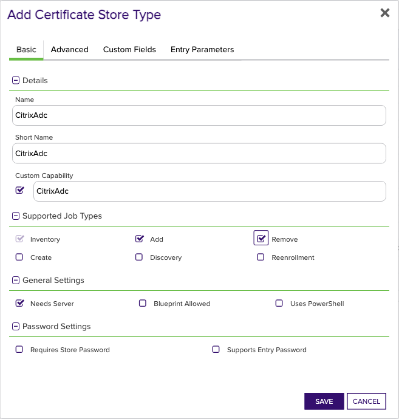
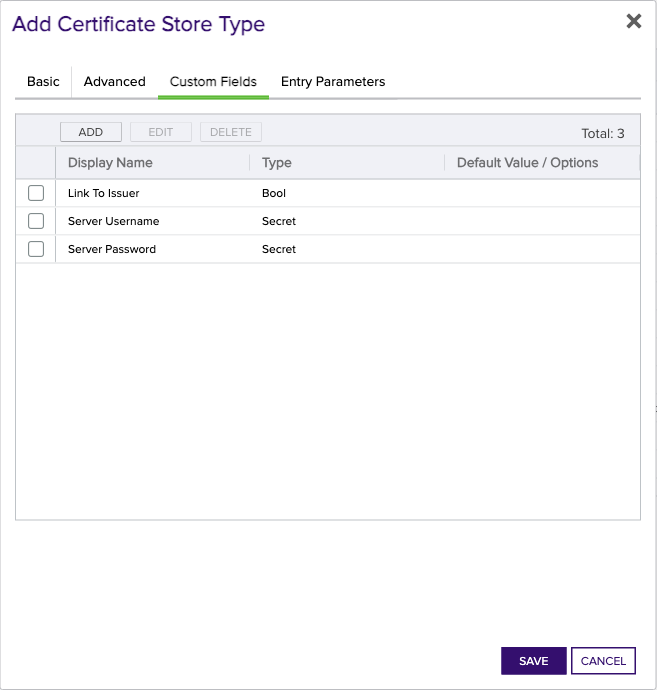
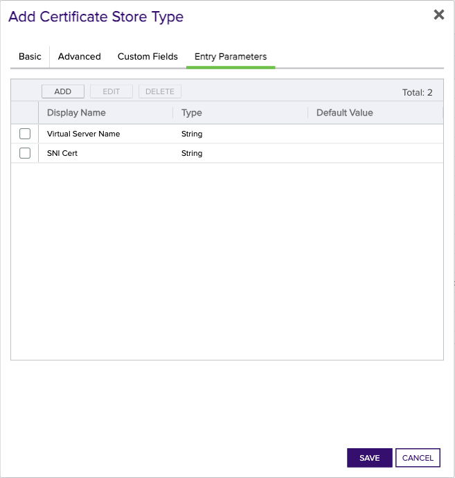

<h1 align="center" style="border-bottom: none">
    Citrix Netscaler Universal Orchestrator Extension
</h1>

<p align="center">
  <!-- Badges -->

<a href="https://github.com/Keyfactor/citrix-adc-orchestrator/releases"></a>


</p>

<p align="center">
  <!-- TOC -->
  <a href="#support">
    <b>Support</b>
  </a>
  ·
  <a href="#installation">
    <b>Installation</b>
  </a>
  ·
  <a href="#license">
    <b>License</b>
  </a>
  ·
  <a href="https://github.com/orgs/Keyfactor/repositories?q=orchestrator">
    <b>Related Integrations</b>
  </a>
</p>

## Overview

The Citrix ADC Orchestrator remotely manages certificate objects on a Citrix ADC device.  Since the ADC supports services including: 
Load Balancing, Authentication/Authorization/Auditing (AAA), and Gateways, this orchestrator can bind to any of these virtual servers when using unique virtual server names for each service.


## Compatibility

This integration is compatible with Keyfactor Universal Orchestrator version 10.4 and later.

## Support
The Citrix Netscaler Universal Orchestrator extension is supported by Keyfactor for Keyfactor customers. If you have a support issue, please open a support ticket with your Keyfactor representative. If you have a support issue, please open a support ticket via the Keyfactor Support Portal at https://support.keyfactor.com. 
 
> To report a problem or suggest a new feature, use the **[Issues](../../issues)** tab. If you want to contribute actual bug fixes or proposed enhancements, use the **[Pull requests](../../pulls)** tab.

## Requirements & Prerequisites

Before installing the Citrix Netscaler Universal Orchestrator extension, we recommend that you install [kfutil](https://github.com/Keyfactor/kfutil). Kfutil is a command-line tool that simplifies the process of creating store types, installing extensions, and instantiating certificate stores in Keyfactor Command.


The Citrix ADC user needs permission to perform the following API calls:

API Endpoint|Methods
---|---
/nitro/v1/config/login|post
/nitro/v1/config/lbvserver| get
/nitro/v1/config/sslcertkey| get, update, add, delete
/nitro/v1/config/sslcertkey_service_binding| get, update, add, delete
/nitro/v1/config/systemfile| get, add, delete

Here is a sample policy with Min Permissions:
* Action: 
Allow
* Command Spec: 
(^stat\s+(cr|cs|lb|system|vpn))|(^(add|rm|show)\s+system\s+file\s+.*)|(^\S+\s+ssl\s+.*)|(^(show|stat|sync)\s+HA\s+.*)|(^save\s+ns\s+config)|(^(switch|show)\s+ns\s+partition.*)


## Create the CitrixAdc Certificate Store Type

To use the Citrix Netscaler Universal Orchestrator extension, you **must** create the CitrixAdc Certificate Store Type. This only needs to happen _once_ per Keyfactor Command instance.


* **Create CitrixAdc using kfutil**:

    ```shell
    # CitrixAdc
    kfutil store-types create CitrixAdc
    ```

* **Create CitrixAdc manually in the Command UI**:
    <details><summary>Create CitrixAdc manually in the Command UI</summary>

    Create a store type called `CitrixAdc` with the attributes in the tables below:

    #### Basic Tab
    | Attribute | Value | Description |
    | --------- | ----- | ----- |
    | Name | CitrixAdc | Display name for the store type (may be customized) |
    | Short Name | CitrixAdc | Short display name for the store type |
    | Capability | CitrixAdc | Store type name orchestrator will register with. Check the box to allow entry of value |
    | Supports Add | ✅ Checked | Check the box. Indicates that the Store Type supports Management Add |
    | Supports Remove | ✅ Checked | Check the box. Indicates that the Store Type supports Management Remove |
    | Supports Discovery | 🔲 Unchecked |  Indicates that the Store Type supports Discovery |
    | Supports Reenrollment | 🔲 Unchecked |  Indicates that the Store Type supports Reenrollment |
    | Supports Create | 🔲 Unchecked |  Indicates that the Store Type supports store creation |
    | Needs Server | ✅ Checked | Determines if a target server name is required when creating store |
    | Blueprint Allowed | 🔲 Unchecked | Determines if store type may be included in an Orchestrator blueprint |
    | Uses PowerShell | 🔲 Unchecked | Determines if underlying implementation is PowerShell |
    | Requires Store Password | 🔲 Unchecked | Enables users to optionally specify a store password when defining a Certificate Store. |
    | Supports Entry Password | 🔲 Unchecked | Determines if an individual entry within a store can have a password. |

    The Basic tab should look like this:

    

    #### Advanced Tab
    | Attribute | Value | Description |
    | --------- | ----- | ----- |
    | Supports Custom Alias | Required | Determines if an individual entry within a store can have a custom Alias. |
    | Private Key Handling | Required | This determines if Keyfactor can send the private key associated with a certificate to the store. Required because IIS certificates without private keys would be invalid. |
    | PFX Password Style | Default | 'Default' - PFX password is randomly generated, 'Custom' - PFX password may be specified when the enrollment job is created (Requires the Allow Custom Password application setting to be enabled.) |

    The Advanced tab should look like this:

    

    #### Custom Fields Tab
    Custom fields operate at the certificate store level and are used to control how the orchestrator connects to the remote target server containing the certificate store to be managed. The following custom fields should be added to the store type:

    | Name | Display Name | Description | Type | Default Value/Options | Required |
    | ---- | ------------ | ---- | --------------------- | -------- | ----------- |
    | linkToIssuer | Link To Issuer | Determines whether an attempt will be made to link the added certificate (via a Management-Add job) to its issuing CA certificate. | Bool | false | 🔲 Unchecked |

    The Custom Fields tab should look like this:

    


    #### Entry Parameters Tab

    | Name | Display Name | Description | Type | Default Value | Entry has a private key | Adding an entry | Removing an entry | Reenrolling an entry |
    | ---- | ------------ | ---- | ------------- | ----------------------- | ---------------- | ----------------- | ------------------- | ----------- |
    | virtualServerName | Virtual Server Name | When adding a certificate, this can be a single VServer name or a comma separated list of VServers to bind to  Note: must match the number of Virtual SNI Cert values. | String |  | 🔲 Unchecked | 🔲 Unchecked | 🔲 Unchecked | 🔲 Unchecked |
    | sniCert | SNI Cert | When adding a certificate, this can be a single boolean value (true/false) or a comma separated list of boolean values to determine whether the binding should use server name indication.  Note: must match the number of Virtual Server Name values. | String |  | 🔲 Unchecked | 🔲 Unchecked | 🔲 Unchecked | 🔲 Unchecked |

    The Entry Parameters tab should look like this:

    


    </details>

## Installation

1. **Download the latest Citrix Netscaler Universal Orchestrator extension from GitHub.** 

    Navigate to the [Citrix Netscaler Universal Orchestrator extension GitHub version page](https://github.com/Keyfactor/citrix-adc-orchestrator/releases/latest). Refer to the compatibility matrix below to determine whether the `net6.0` or `net8.0` asset should be downloaded. Then, click the corresponding asset to download the zip archive.
    | Universal Orchestrator Version | Latest .NET version installed on the Universal Orchestrator server | `rollForward` condition in `Orchestrator.runtimeconfig.json` | `citrix-adc-orchestrator` .NET version to download |
    | --------- | ----------- | ----------- | ----------- |
    | Older than `11.0.0` | | | `net6.0` |
    | Between `11.0.0` and `11.5.1` (inclusive) | `net6.0` | | `net6.0` | 
    | Between `11.0.0` and `11.5.1` (inclusive) | `net8.0` | `Never` | `net6.0` | 
    | Between `11.0.0` and `11.5.1` (inclusive) | `net8.0` | `LatestMajor` | `net8.0` | 
    | `11.6` _and_ newer | `net8.0` | | `net8.0` |

    Unzip the archive containing extension assemblies to a known location.

    > **Note** If you don't see an asset with a corresponding .NET version, you should always assume that it was compiled for `net6.0`.

2. **Locate the Universal Orchestrator extensions directory.**

    * **Default on Windows** - `C:\Program Files\Keyfactor\Keyfactor Orchestrator\extensions`
    * **Default on Linux** - `/opt/keyfactor/orchestrator/extensions`
    
3. **Create a new directory for the Citrix Netscaler Universal Orchestrator extension inside the extensions directory.**
        
    Create a new directory called `citrix-adc-orchestrator`.
    > The directory name does not need to match any names used elsewhere; it just has to be unique within the extensions directory.

4. **Copy the contents of the downloaded and unzipped assemblies from __step 2__ to the `citrix-adc-orchestrator` directory.**

5. **Restart the Universal Orchestrator service.**

    Refer to [Starting/Restarting the Universal Orchestrator service](https://software.keyfactor.com/Core-OnPrem/Current/Content/InstallingAgents/NetCoreOrchestrator/StarttheService.htm).


> The above installation steps can be supplimented by the [official Command documentation](https://software.keyfactor.com/Core-OnPrem/Current/Content/InstallingAgents/NetCoreOrchestrator/CustomExtensions.htm?Highlight=extensions).


## Post Installation

An optional config.json configuration file has been provided in the extensions folder with a single setting - AutoSaveConfig.  Setting this value to "Y" means successful changes made by a management job will automatically be saved to disk; no interaction with the Citrix ADC UI is necessary.  Setting this value to "N" (or if the config entry or config file is missing) will keep these changes in memory only.

**NOTE:** Any changes in-process through the Citrix ADC UI will also be persisted to disk when a management job is performed and the AutoSaveConfig flag is set to 'Y'.


## Defining Certificate Stores


* **Manually with the Command UI**

    <details><summary>Create Certificate Stores manually in the UI</summary>

    1. **Navigate to the _Certificate Stores_ page in Keyfactor Command.**

        Log into Keyfactor Command, toggle the _Locations_ dropdown, and click _Certificate Stores_.

    2. **Add a Certificate Store.**

        Click the Add button to add a new Certificate Store. Use the table below to populate the **Attributes** in the **Add** form.
        | Attribute | Description |
        | --------- | ----------- |
        | Category | Select "CitrixAdc" or the customized certificate store name from the previous step. |
        | Container | Optional container to associate certificate store with. |
        | Client Machine | The DNS or IP Address of the Citrix ADC Appliance. |
        | Store Path | The path where certificate files are located on the Citrix ADC appliance.  This value will likely be /nsconfig/ssl/ |
        | Orchestrator | Select an approved orchestrator capable of managing `CitrixAdc` certificates. Specifically, one with the `CitrixAdc` capability. |
        | linkToIssuer | Determines whether an attempt will be made to link the added certificate (via a Management-Add job) to its issuing CA certificate. |


        

    </details>

* **Using kfutil**
    
    <details><summary>Create Certificate Stores with kfutil</summary>
    
    1. **Generate a CSV template for the CitrixAdc certificate store**

        ```shell
        kfutil stores import generate-template --store-type-name CitrixAdc --outpath CitrixAdc.csv
        ```
    2. **Populate the generated CSV file**

        Open the CSV file, and reference the table below to populate parameters for each **Attribute**.
        | Attribute | Description |
        | --------- | ----------- |
        | Category | Select "CitrixAdc" or the customized certificate store name from the previous step. |
        | Container | Optional container to associate certificate store with. |
        | Client Machine | The DNS or IP Address of the Citrix ADC Appliance. |
        | Store Path | The path where certificate files are located on the Citrix ADC appliance.  This value will likely be /nsconfig/ssl/ |
        | Orchestrator | Select an approved orchestrator capable of managing `CitrixAdc` certificates. Specifically, one with the `CitrixAdc` capability. |
        | linkToIssuer | Determines whether an attempt will be made to link the added certificate (via a Management-Add job) to its issuing CA certificate. |


        

    3. **Import the CSV file to create the certificate stores** 

        ```shell
        kfutil stores import csv --store-type-name CitrixAdc --file CitrixAdc.csv
        ```
    </details>

> The content in this section can be supplimented by the [official Command documentation](https://software.keyfactor.com/Core-OnPrem/Current/Content/ReferenceGuide/Certificate%20Stores.htm?Highlight=certificate%20store).


## Notes and Limitations

* As of release 2.2.0, ONLY certificate objects (installed certificates) will be managed by the Citrix ADC Orchestrator Extension.  Prior versions also managed certificate/key file combinations uploaded to the Citrix ADC device but not yet installed.  This functionality has been removed due to issues attempting to match certificate and key files due to inconsistent file naming.

* Direct PFX Binding Inventory: In NetScaler you can directly Bind a Pfx file to a Virtual Server.  Keyfactor cannot inventory these because it does not have access to the password.  The recommended way to Import PFX Files in NetScaler is descibed in this [NetScaler Documentation](https://docs.netscaler.com/en-us/citrix-adc/12-1/ssl/ssl-certificates/export-existing-certs-keys.html#convert-ssl-certificates-for-import-or-export)

* Removing Certs from Store: As defined in Test Cases 5 and 13 below, certificates that are bound to a server will not be removed.  This was done to limit the possibility of bringing production servers down.  Users are currently required to manually unbind the certificate from the server first and then remove via the Command and this orchestrator extension.

## Test Cases

Case Number|Case Name|Enrollment Params|Expected Results|Passed|Screenshot
----|------------------------|------------------------------------|--------------|----------------|-------------------------
1	|Add Unbound Cert|**Alias:** TC1.boingy.com<br/>**Virtual Server Name:**<br/>**Sni Cert:** false|Adds New Unbound Cert To Citrix ADC|True|
2	|Remove Unbound Cert|**Alias:** TC1.boingy.com<br/>**Virtual Server Name:**<br/>**Sni Cert:** false|Removes Unbound Cert From Citrix ADC|True|
3	|Add Bound Cert|**Alias:** TC3.boingy.com<br/>**Virtual Server Name:** TestVServer<br/>**Sni Cert:** false|Adds a new bound cert to TestVServer Virtual Server|True|
4	|Add Bound Cert Multiple VServers|**Alias:** TC4.boingy.com<br/>**Virtual Server Name:** TestVServer,TestVServer2<br/>**Sni Cert:** false,false|Adds New Bound Cert To Both Servers in Citrix|True|
5	|Remove Bound Cert|**Alias:** TC4.boingy.com<br/>**Virtual Server Name:**<br/>**Sni Cert:** false|Will Not Remove because it is bound.  Must Unbind it First|True|
6	|Renew Bound Cert|**Alias:** TC4.boingy.com<br/>**Virtual Server Name:**<br/>**Sni Cert:** false|Renews Bound Cert on Both VServers|True|
7	|Replace Bound Cert No Overwrite |**Alias:** TC4.boingy.com<br/>**Virtual Server Name:** TestVServer,TestVServer2<br/>**Sni Cert:** false,false|Will Not replace, overwrite flag needed|True|
8	|Replace Bound Cert with Overwrite|**Alias:** 16934<br/>**Virtual Server Name:**<br/>**Sni Cert:** false|Will do the replace because overwrite was used|True|
9	|Add Sni Cert and Bind|**Alias:** TC9.boingy.com<br/>**Virtual Server Name:** TestVServer<br/>**Sni Cert:** false|Will bind an additional SNI Cert to a VServer|True|
10	|Renew bound Sni Cert|**Alias:** TC10.boingy.com<br/>**Virtual Server Name:**<br/>**Sni Cert:** false|Will Renew the Sni Cert Bound to the Site|True|
11	|Replace bound Sni Cert with Overwrite|**Alias:** TC9.boingy.com<br/>**Virtual Server Name:** TestVServer<br/>**Sni Cert:** true|Sni Cert Will Be Replaced and bound|True|
12	|Remove Bound Sni Cert|**Alias:** TC9.boingy.com<br/>**Virtual Server Name:**<br/>**Sni Cert:** false|Will Not Remove because it is bound.  Must Unbind it First|True|
13	|Add Sni Cert To Multiple VServers and bind|**Alias:** TC13.boingy.com<br/>**Virtual Server Name:** TestVServer,TestVServer2<br/>**Sni Cert:** false,true|Adds and binds Cert to TestVServer and adds and binds Sni Cert to TestVServer2|True|
14	|Inventory |No Params|Will Perform Inventory and pull down all Certs Tied to VServers|True|


## License

Apache License 2.0, see [LICENSE](LICENSE).

## Related Integrations

See all [Keyfactor Universal Orchestrator extensions](https://github.com/orgs/Keyfactor/repositories?q=orchestrator).