# Citrix Netscaler Universal Orchestrator
## Orchestrator

Orchestrator to manage certificates and keys on one to many VServers in Netscaler.  The integration supports Enrollment, Renewal, Inventory and Remove from Store.

## Development Ready

<!-- add integration specific information below -->
*** 
**Netscaler Cert Store Type Setup**

*1. Cert Store Type Basic Settings*

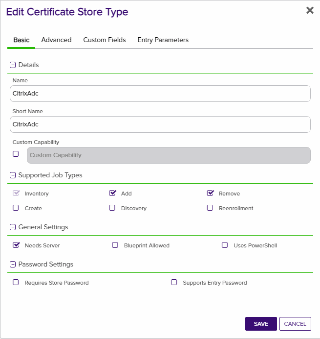

*2. Cert Store Type Advanced Settings*
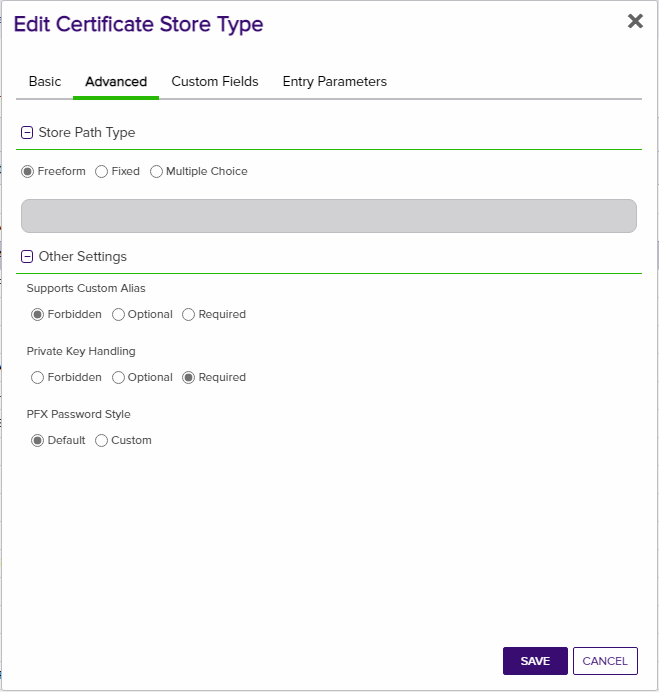

*3. Cert Store Type Custom Fields*
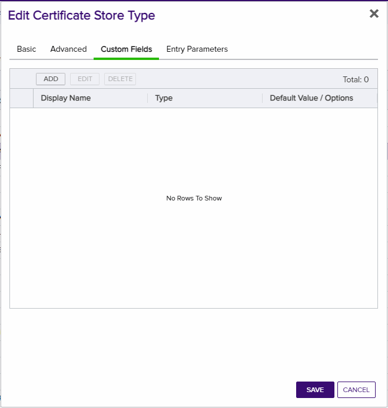

*4. Cert Store Type Entry Params - Virtual Server*
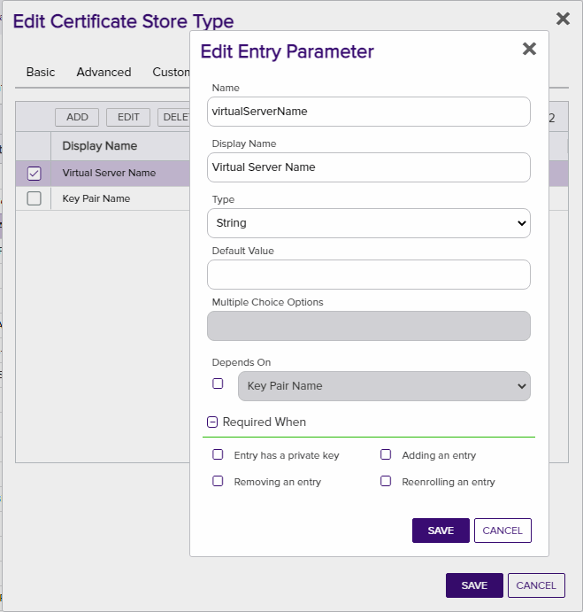

*5. Cert Store Type Entry Params - KPEntry*
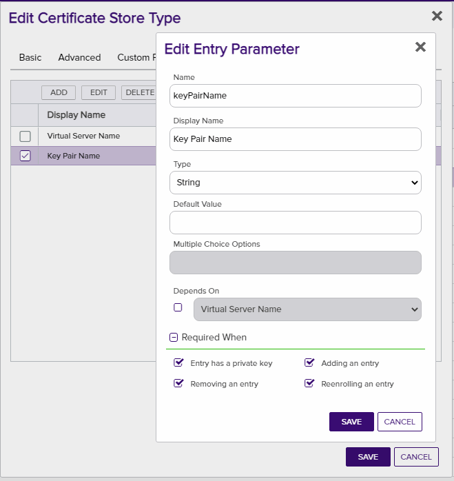

#### STORE TYPE ENTRY PARAMS
CONFIG ELEMENT	| DESCRIPTION
------------------|------------------
Virtual Server	| When Enrolling, this can be a single or comma separated list of VServers in Netscaler to replace.
Key Pair| When Enrolling, this is the name of the Certificate that will be installed on Netscaler

**Netscaler Cert Store Setup**

*1. Cert Store Base Settings*

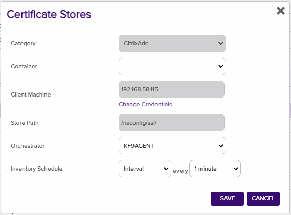

*2. Cert Store Credential Setup*

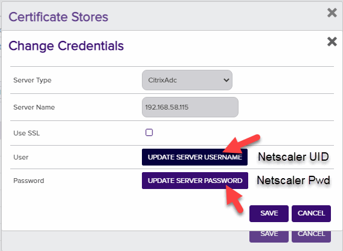

#### STORE CONFIG
CONFIG ELEMENT	| DESCRIPTION
------------------|------------------
Client Machine	| This is the IP Address of the Netscaler Appliance.
Store Path| This is the path of the Netscaler Appliance.  The value shown in the screenshot is the default path.
User| This is the user that will be authenticated against the Netscaler Appliance
Password| This is the password that will be authenticated against the Netscaler Appliance

**Enrollment Multiple Virtual Servers**

This will enroll the certificate and bind it to multiple VServers.  If you just want one VServer then include that one Server without commas.

*1. Comma Separate the VServers*

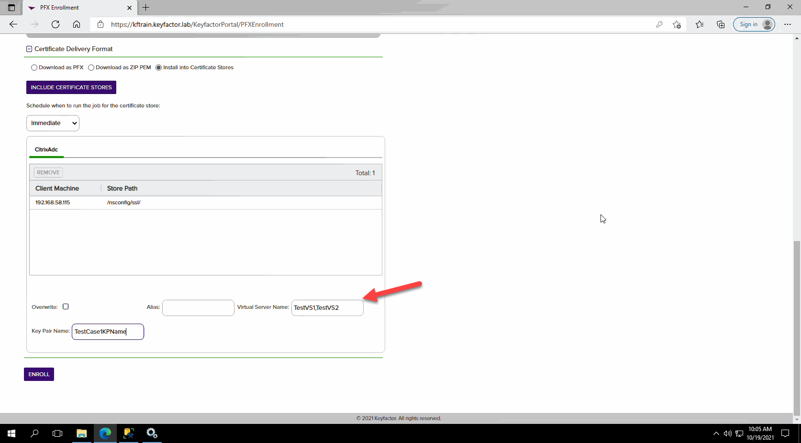

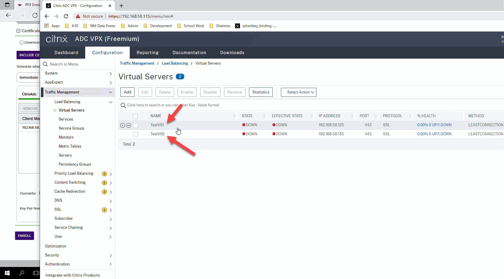

**Renewal**

This will renew the certificate and update all of the VServer Bindings on Netscaler that have that same thumbprint.

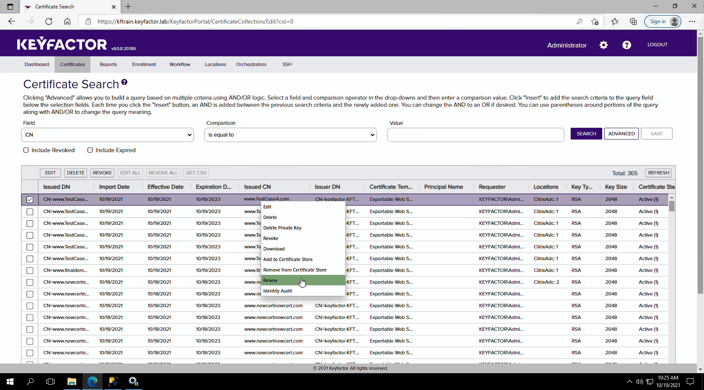

**Inventory**

This will inventory the certs on the Netscaler appliance and also update the entry parameters back into Keyfactor.

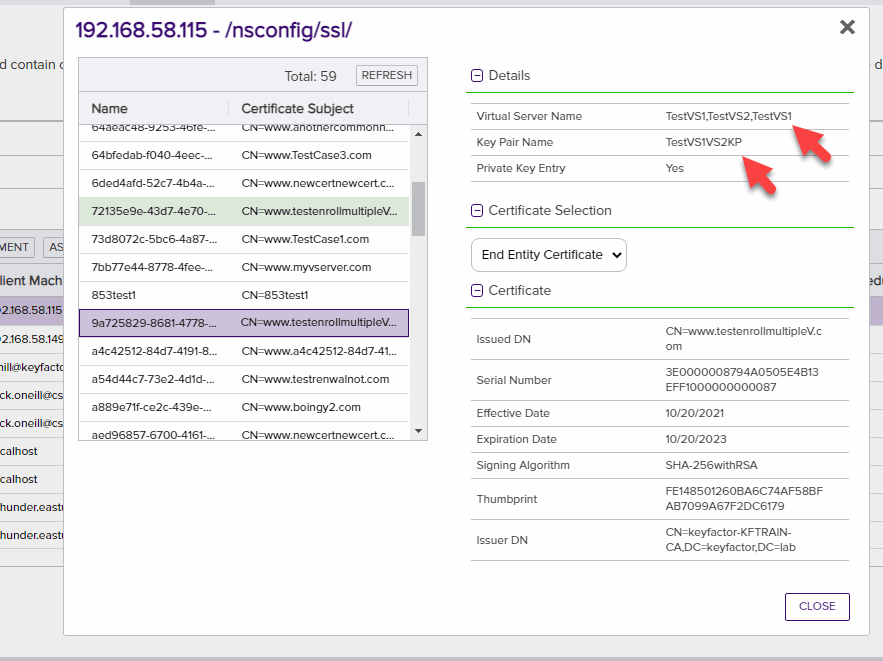

**Remove From Store**

This will remove it from the store on Keyfactor and deleted the associated certificate file on Netscaler.  It will leave the Key Pair and Key on Netscaler.
You should not need to specify a VServer or KPair for removal.  This can be setup in the configuration of Keyfactor to not be needed for removal.

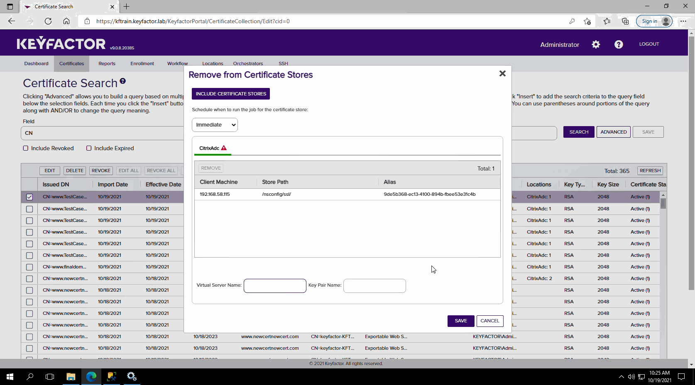
