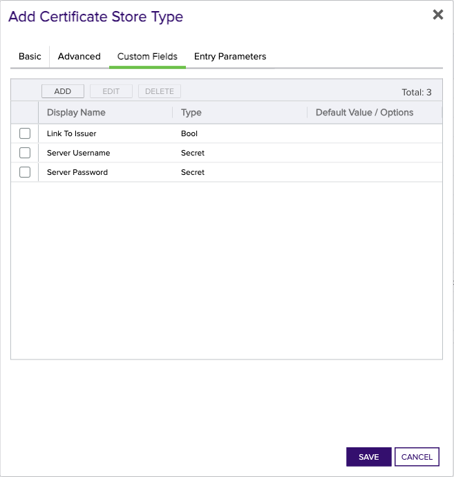

## CitrixAdc

The CitrixAdc Certificate Store Type is designed to manage and handle certificates on Citrix ADC (formerly NetScaler) devices. This Certificate Store Type enables Keyfactor Command to remotely add, remove, and inventory certificates on the Citrix ADC, supporting critical services such as Load Balancing, Authentication/Authorization/Auditing (AAA), and Gateways.

The CitrixAdc Certificate Store Type represents specific locations on the Citrix ADC device where certificates are stored, such as paths on the appliance or configurations linked to virtual servers. These stores are essential for maintaining secure communications and proper certificate management.

However, there are some caveats and limitations associated with this Certificate Store Type. For instance, direct PFX file binding inventory is not supported because Keyfactor cannot access the password for these files. Users must import PFX files following Citrix guidelines. Moreover, downtime may occur when replacing certificates, albeit for a brief moment, due to the Citrix-recommended method for cert replacement.

Another consideration is the removal of certificates. Certificates that are bound to a server will not be automatically removed to prevent potential disruptions in production environments. Users are required to manually unbind certificates before removal. Additionally, renewal processes will update all instances of a certificate across VServers.

The CitrixAdc Certificate Store Type does not utilize an SDK. Instead, it leverages direct interactions with the Citrix ADC API to perform its functions. Users should also be aware of configuration specifications, such as using a comma-separated list of values when binding to multiple VServers and handling SNI certificates.

Overall, while the CitrixAdc Certificate Store Type provides robust capabilities for managing certificates on Citrix ADC devices, users should be aware of these limitations and best practices to ensure effective and smooth operations.


### Supported Job Types

| Job Name | Supported |
| -------- | --------- |
| Inventory | ✅ |
| Management Add | ✅ |
| Management Remove | ✅ |
| Discovery |  |
| Create |  |
| Reenrollment |  |

## Requirements

### Step-by-Step Configuration

#### 1. Citrix Netscaler Configuration
- Ensure your Citrix Netscaler device is properly set up and accessible.
- The NetScaler user must have permissions to perform specific API calls as follows:

API Endpoint | Methods
--- | ---
/nitro/v1/config/login | post
/nitro/v1/config/lbvserver | get
/nitro/v1/config/sslcertkey | get, update, add, delete
/nitro/v1/config/sslcertkey_service_binding | get, update, add, delete
/nitro/v1/config/systemfile | get, add, delete

For instance, set the permissions for the NetScaler user as follows:

- **Action:** Allow
- **Command Spec:**
  ```
  (^stat\s+(cr|cs|lb|system|vpn))|(^(add|rm|show)\s+system\s+file\s+.*)|(^\S+\s+ssl\s+.*)|(^(show|stat|sync)\s+HA\s+.*)|(^save\s+ns\s+config)|(^(switch|show)\s+ns\s+partition.*)
  ````

#### 2. Service Account Creation
- Create a service account on the Citrix Netscaler device with the permissions specified above.

#### 3. Version Requirements
- Ensure you are running a compatible version of Citrix ADC that supports the necessary API endpoints and functionalities required by the CitrixAdc Certificate Store Type.

### Additional Notes

- **Direct PFX Binding Inventory:** Keyfactor cannot inventory directly bound PFX files on Netscaler because it does not have access to the password. Refer to [NetScaler Documentation](https://docs.netscaler.com/en-us/citrix-adc/12-1/ssl/ssl-certificates/export-existing-certs-keys.html#convert-ssl-certificates-for-import-or-export) for guidance on how to import PFX files.
- **Replacing Certificates:** The orchestrator replaces bound certificates following [NetScaler recommended methods](https://docs.netscaler.com/en-us/citrix-adc/12-1/ssl/ssl-certificates/add-group-certs.html), causing a sub-second blip of downtime.
- **Removing Certificates:** Certificates bound to a virtual server will not be removed automatically. You need to unbind the certificate manually before removal.
- **Renewals:** Renewal processes update the certificate's thumbprint across all virtual servers where it is used.


## Certificate Store Type Configuration

The recommended method for creating the `CitrixAdc` Certificate Store Type is to use [kfutil](https://github.com/Keyfactor/kfutil). After installing, use the following command to create the `` Certificate Store Type:

```shell
kfutil store-types create CitrixAdc
```

<details><summary>CitrixAdc</summary>

Create a store type called `CitrixAdc` with the attributes in the tables below:

### Basic Tab
| Attribute | Value | Description |
| --------- | ----- | ----- |
| Name | CitrixAdc | Display name for the store type (may be customized) |
| Short Name | CitrixAdc | Short display name for the store type |
| Capability | CitrixAdc | Store type name orchestrator will register with. Check the box to allow entry of value |
| Supported Job Types (check the box for each) | Add, Discovery, Remove | Job types the extension supports |
| Supports Add | ✅ | Check the box. Indicates that the Store Type supports Management Add |
| Supports Remove | ✅ | Check the box. Indicates that the Store Type supports Management Remove |
| Supports Discovery |  |  Indicates that the Store Type supports Discovery |
| Supports Reenrollment |  |  Indicates that the Store Type supports Reenrollment |
| Supports Create |  |  Indicates that the Store Type supports store creation |
| Needs Server | ✅ | Determines if a target server name is required when creating store |
| Blueprint Allowed |  | Determines if store type may be included in an Orchestrator blueprint |
| Uses PowerShell |  | Determines if underlying implementation is PowerShell |
| Requires Store Password |  | Determines if a store password is required when configuring an individual store. |
| Supports Entry Password |  | Determines if an individual entry within a store can have a password. |

The Basic tab should look like this:


### Advanced Tab
| Attribute | Value | Description |
| --------- | ----- | ----- |
| Supports Custom Alias | Required | Determines if an individual entry within a store can have a custom Alias. |
| Private Key Handling | Required | This determines if Keyfactor can send the private key associated with a certificate to the store. Required because IIS certificates without private keys would be invalid. |
| PFX Password Style | Default | 'Default' - PFX password is randomly generated, 'Custom' - PFX password may be specified when the enrollment job is created (Requires the Allow Custom Password application setting to be enabled.) |

The Advanced tab should look like this:


### Custom Fields Tab
Custom fields operate at the certificate store level and are used to control how the orchestrator connects to the remote target server containing the certificate store to be managed. The following custom fields should be added to the store type:

| Name | Display Name | Type | Default Value/Options | Required | Description |
| ---- | ------------ | ---- | --------------------- | -------- | ----------- |


The Custom Fields tab should look like this:




</details>

## Certificate Store Configuration

After creating the `CitrixAdc` Certificate Store Type and installing the Citrix Netscaler Universal Orchestrator extension, you can create new [Certificate Stores](https://software.keyfactor.com/Core-OnPrem/Current/Content/ReferenceGuide/Certificate%20Stores.htm?Highlight=certificate%20store) to manage certificates in the remote platform.

The following table describes the required and optional fields for the `CitrixAdc` certificate store type.

| Attribute | Description | Attribute is PAM Eligible |
| --------- | ----------- | ------------------------- |
| Category | Select "CitrixAdc" or the customized certificate store name from the previous step. | |
| Container | Optional container to associate certificate store with. | |
| Client Machine | Enter the IP address of the Citrix Netscaler appliance where the certificates will be managed. Example: '192.168.1.100'. | |
| Store Path | Enter the path on the Citrix Netscaler appliance where the certificates are stored. Example: '/nsconfig/ssl/'. | |
| Orchestrator | Select an approved orchestrator capable of managing `CitrixAdc` certificates. Specifically, one with the `CitrixAdc` capability. | |

* **Using kfutil**

    ```shell
    # Generate a CSV template for the AzureApp certificate store
    kfutil stores import generate-template --store-type-name CitrixAdc --outpath CitrixAdc.csv

    # Open the CSV file and fill in the required fields for each certificate store.

    # Import the CSV file to create the certificate stores
    kfutil stores import csv --store-type-name CitrixAdc --file CitrixAdc.csv
    ```

* **Manually with the Command UI**: In Keyfactor Command, navigate to Certificate Stores from the Locations Menu. Click the Add button to create a new Certificate Store using the attributes in the table above.